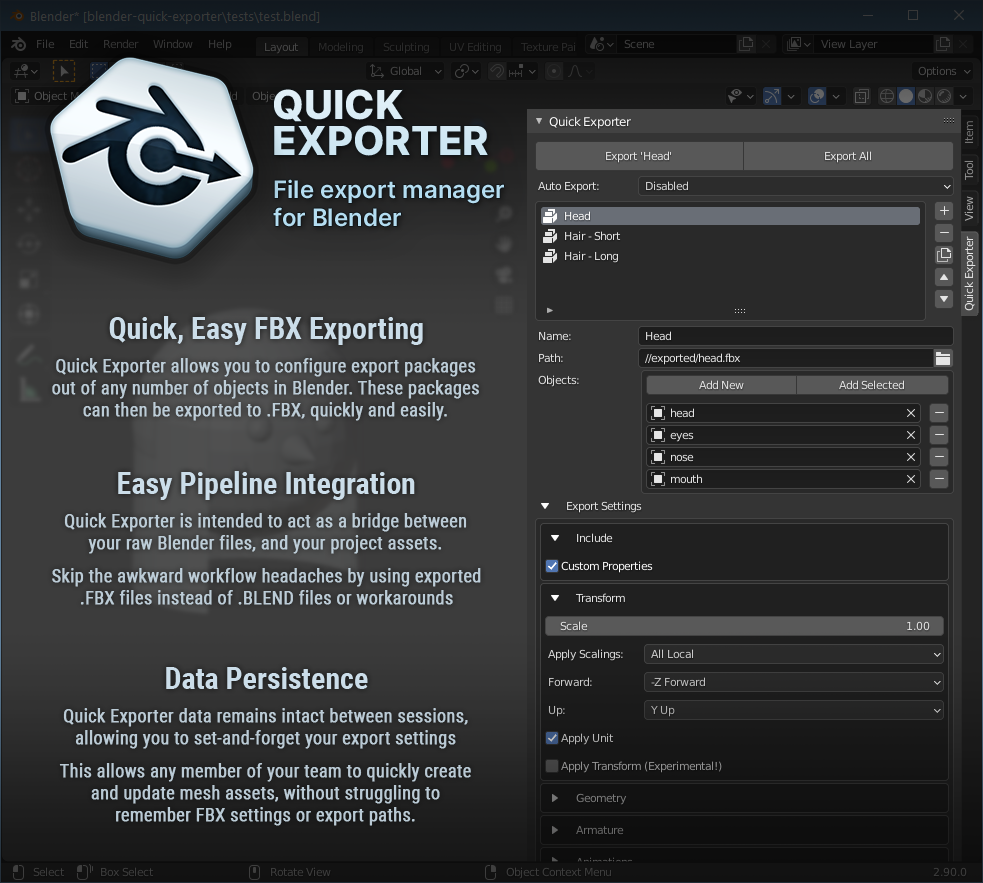
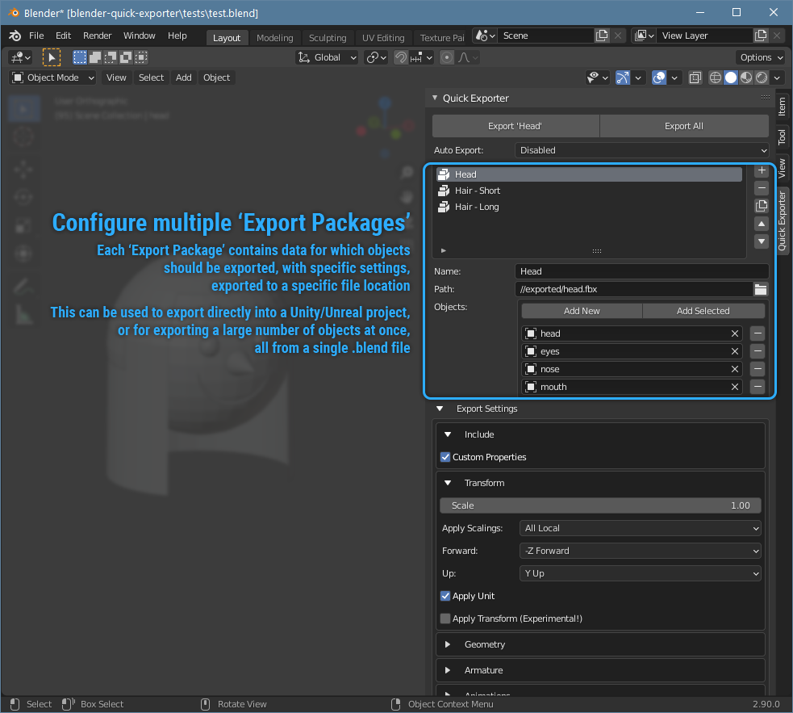
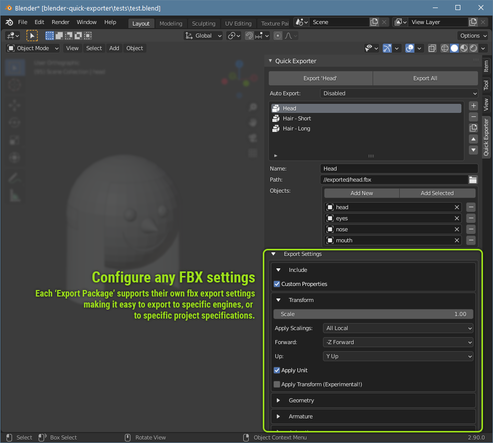
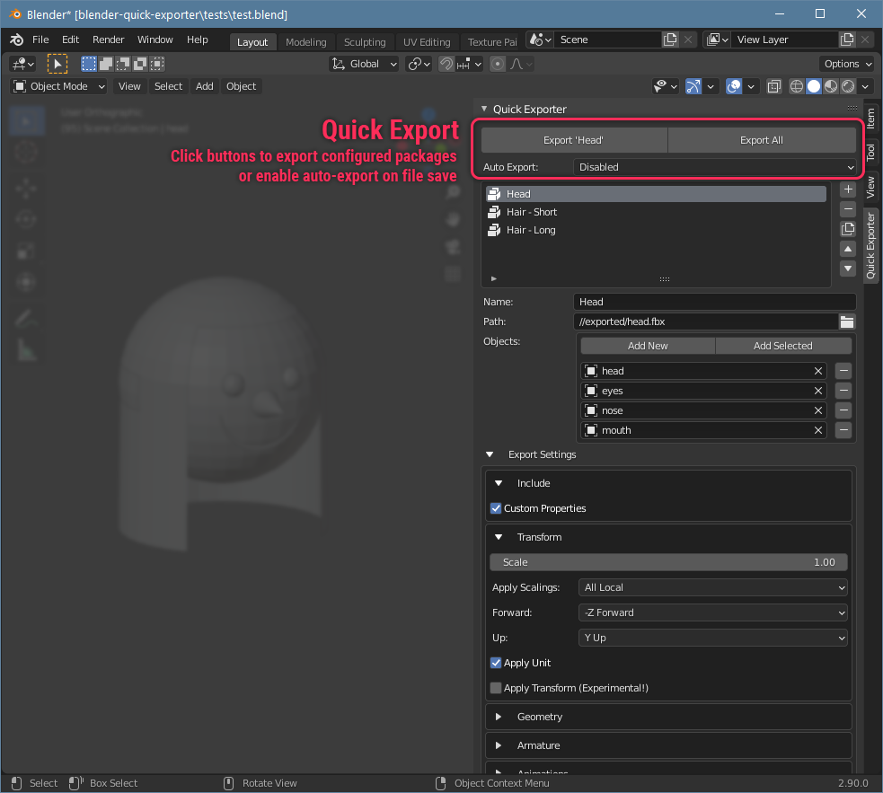

# What is Quick Exporter?
Quick Exporter is a **free** Blender addon by [Wilder](https://wilder.games), which allows users to configure and manage exportable packages from objects within a Blender file.

These **Export Packages** can be exported manually and/or automatically, as a single or individual **.fbx** files.

This addon is intended to act as a **set-it-and-forget-it** solution to **.fbx** exporting.

Once you've created and configured your export packages, you shouldn't need to change the Quick Exporter settings very often. Simply make changes to your file, click Export, and you're done.

 

  
   
  
  

 

# What does it accomplish?
**In Blender?**  
Quick Exporter allows for faster, easier, and more straightforward **.fbx** exporting from Blender. It saves your export data (including settings, locations, objects to include) and delegates all the work of remembering or coordinating this information into a handy editor panel.

**For game development?**  
Instead of importing your *.blend* files directly into your projects, or using Blender's built-in (but non-persistent) *Export To* functions, Quick Exporter allows you to set up an asset pipeline which disconnects your source files from your asset files. The benefit of this being: More control over export settings, content, locations, and update frequency.

In game engines such as **Unity** or **Unreal** this allows us to easily avoid orientation errors, incorrect exported object selections, and animation issues caused by inconsistent export settings.

 

# Free, huh?
Heck yeah, **100% free**.

 

# Source Code  
As a Blender addon, the Quick Exporter source code is bundled with every version. 

Officially, Quick Exporter is available for download from [github](https://github.com/wildergames/blender-quick-exporter)

 

## License
AGPL-3.0 

 

## Open Source Considerations
This repo is open to pull requests, issue submissions, and suggestions.

 

# How to Use
Using Quick Exporter is intended to be quick and easy.

 

## Quick Start
1. Install addon
2. Open addon panel *(View3D > Sidebar > Quick Exporter)*
3. Create a new *'Export Package'*
4. Add a *name* to the new export package
5. Add a *path* to export your package to
6. Add any number of *objects* and/or *collections* to the new export package
7. If necessary, modify the export settings
8. Click one of the two *Export* buttons, or enable *Auto-Export*

That's it.

Now you have an Export Package which will always export the objects you've specified to the location specified, using the settings specified. This can be done with one click of a button, or when the file is saved.

 

## Installation
This addon can be installed by copying the contents of *quick-exporter.zip* into your Blender addons directory.

Make sure to copy the entire *quick-exporter* directory to your Blender addons directory.

 

## The 'Quick Exporter' Panel
This addon is controlled from a single panel in Blender, located at:  
*3D Viewport &gt; Sidebar &gt; Quick Exporter*

 

## Creating an Export Package
An *'Export Package'* is a collection of Blender scene objects intended to be exported to a single .fbx file.

From the Quick Exporter panel, you can create a new export package from the package list. With this complete, you'll be able to set all the necessary .fbx export settings, as well as a path for your exported .fbx file.

 

## Exporting an Export Package
Once you've created and configured one or more export packages, the *Export All* button will export all packages to their intended locations.

Alternatively, you may select an individual package from the list, and click the *Export 'Package'* button, where 'Package' is the name of your selected package.

 

## Auto-Export
In the Quick Exporter panel, there is an option to enable auto-exporting on save. You can choose one of the following options:

**Disabled**  
This will prevent Quick Exporter from automatically exporting on save. This is the default auto-export setting. With this option selected, users are required to manually use the <em>Export</em> buttons through the Quick Exporter interface.

**Auto-Export On Save**  
This will export all packages when the Blend File is saved.

 

# Planned Features
We're planning on adding more features to Quick Exporter in the future, including:

**Export Settings data objects**  
Adding the ability to store and reference various embedded Export Settings objects (just like Materials, or Textures), instead of having one unique set of settings per Export Package. This would allow us to also store defaults for various export platforms and variations. For example: FBX Standard, Unity, Unity (Animated), Unreal, Unreal (Animated), etc.

**Support for more export file types**  
Adding support for exporting more export file types, along with .fbx

---

 
